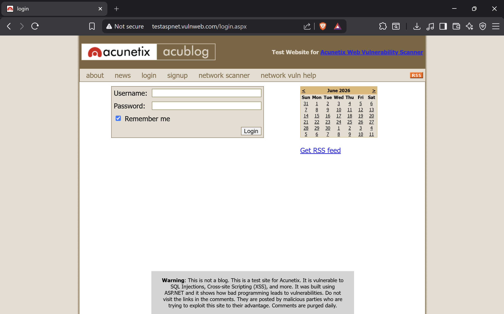
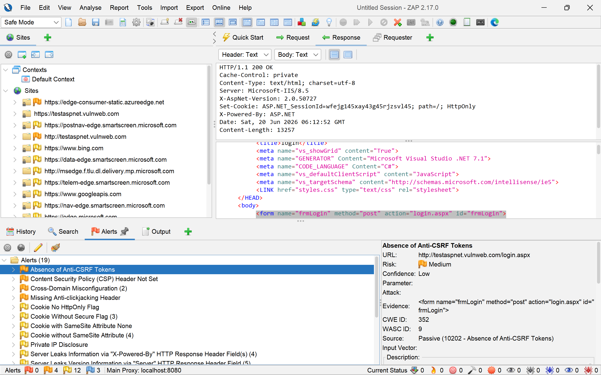
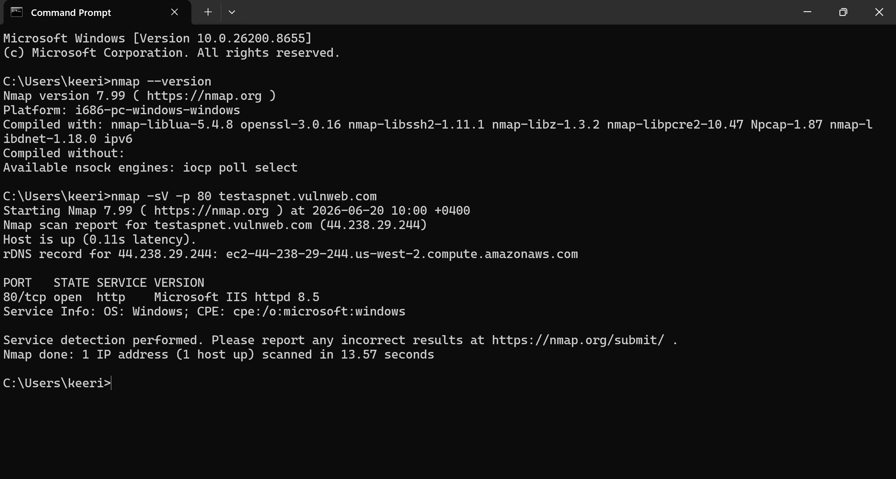
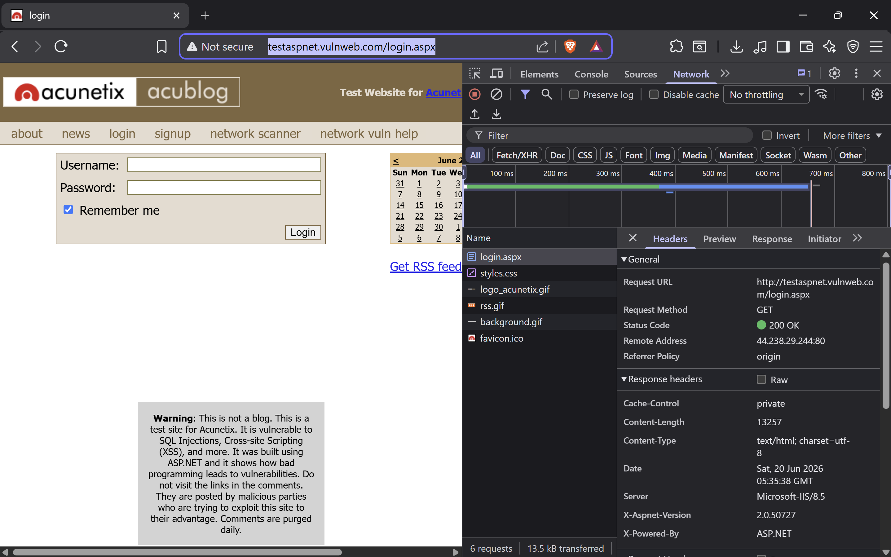

# Vulnerability Assessment Report – Live Website

## Future Interns Cyber Security Internship

**Prepared by:** Keerit Kapoor
**Task:** Task 1 – Vulnerability Assessment Report
**Assessment Date:** 20 June 2026
**Target:** `http://testaspnet.vulnweb.com/login.aspx`

---

## Objective

Conduct a limited and ethical vulnerability assessment of a public security-training web application. The work focused on observable security weaknesses, evidence collection, risk classification, and remediation guidance.

> **Ethical Scope:** Only passive observation and a limited Nmap service-identification scan were conducted. No SQL injection, credential testing, brute force, active scanning, exploitation, or modification of data was performed.

---

## Tools Used

* **Nmap 7.99** – limited service detection on TCP port 80
* **OWASP ZAP 2.17.0** – Safe Mode, passive analysis only
* **Browser Developer Tools** – HTTP request and response-header inspection
* **GitHub** – portfolio documentation and evidence storage

---

## Scope and Methodology

1. Reviewed the login page manually to confirm whether secure HTTPS transport was used.
2. Inspected the document response and headers using Browser Developer Tools.
3. Ran a limited Nmap command against the authorised demo target:

```text
nmap -sV -p 80 testaspnet.vulnweb.com
```

4. Explored only the login page through OWASP ZAP in **Safe Mode** and reviewed passive alerts.
5. Excluded active scanning, form submission, authentication attempts, SQL injection, XSS testing, brute forcing, and exploitation.

---

## Executive Summary

The assessment identified a high-risk transport-security weakness: the login page is accessible over unencrypted HTTP while displaying username and password fields.

Additional findings included missing browser-side protection headers and unnecessary technology/version disclosure through HTTP response headers. OWASP ZAP also flagged a possible absence of anti-CSRF tokens; this alert has **low confidence** and would require authorised manual validation before being treated as a confirmed vulnerability.

---

## Findings Summary

| ID   | Finding                                           | Severity | Status              |
| ---- | ------------------------------------------------- | -------: | ------------------- |
| F-01 | Sensitive Login Page Served Over Unencrypted HTTP |     High | Confirmed           |
| F-02 | Missing Browser Security Headers                  |   Medium | Confirmed           |
| F-03 | Server and Framework Information Disclosure       |      Low | Confirmed           |
| F-04 | Possible Absence of Anti-CSRF Tokens              |   Medium | Requires Validation |

---

# F-01: Sensitive Login Page Served Over Unencrypted HTTP

**Severity:** High
**Affected URL:** `http://testaspnet.vulnweb.com/login.aspx`

## Description

The login page is delivered over HTTP rather than HTTPS. The page contains username and password fields while the browser displays a **Not secure** indicator.

HTTP traffic is not encrypted, which can expose sensitive information when users access the site through untrusted networks.

## Evidence



## Potential Impact

* Credentials could be exposed in transit.
* Network attackers may be able to alter traffic.
* Users receive a browser warning and may lose trust in the site.

## Recommendation

* Enforce HTTPS across the application.
* Redirect all HTTP requests to HTTPS.
* Enable HTTP Strict Transport Security (HSTS).
* Set the `Secure` attribute on authentication and session cookies.

---

# F-02: Missing Browser Security Headers

**Severity:** Medium
**Evidence Source:** OWASP ZAP passive scan

## Description

OWASP ZAP passive analysis reported missing browser-side protection headers, including:

* Content Security Policy (CSP)
* Anti-clickjacking protection header

These headers help reduce risks such as unwanted framing of the website and certain browser-based content-injection issues.

## Evidence



## Recommendation

* Implement a restrictive Content Security Policy.
* Add `X-Frame-Options: DENY` or use the `frame-ancestors` CSP directive.
* Review all security headers regularly.

---

# F-03: Server and Framework Information Disclosure

**Severity:** Low
**Affected URL:** `http://testaspnet.vulnweb.com/login.aspx`

## Description

The target exposes server and framework details through both Nmap service detection and HTTP response headers.

Observed details include:

* `Microsoft IIS httpd 8.5`
* `X-AspNet-Version: 2.0.50727`
* `X-Powered-By: ASP.NET`

## Evidence

### Nmap Service Detection



### Browser Response Headers



## Potential Impact

Exposed technology details can make reconnaissance easier by helping attackers identify the server and framework versions in use.

## Recommendation

* Remove unnecessary response headers such as `X-Powered-By`.
* Avoid exposing framework and detailed server-version information.
* Keep web-server software and application frameworks patched.

---

# F-04: Possible Absence of Anti-CSRF Tokens

**Severity:** Medium
**Confidence:** Low
**Status:** Requires authorised validation

## Description

OWASP ZAP passively flagged a possible absence of anti-CSRF tokens on the login form. The alert was generated without submitting the form or performing any active testing.

Because ZAP marked the alert with **low confidence**, this should be treated as a potential issue rather than a confirmed vulnerability.

## Recommendation

* Validate the login workflow only with written authorisation.
* Use anti-CSRF tokens on state-changing requests where appropriate.
* Confirm server-side validation of those tokens.

---

## Risk Rating Guide

| Severity | Meaning                                                    |
| -------- | ---------------------------------------------------------- |
| High     | Could significantly affect sensitive data or user security |
| Medium   | Creates meaningful risk and should be remediated           |
| Low      | Limited exposure, but should still be addressed            |

---

## Evidence Files

```text
screenshots/
├── http_login_page.png
├── nmap_port_80.png
├── response_headers.png
└── zap_passive_alerts.png
```

---

## Full Report

[Open the full Vulnerability Assessment Report](Vulnerability_Assessment_Report_Keerit_Kapoor_UPDATED.pdf)

---

## Skills Demonstrated

* Passive web-application security assessment
* Nmap service identification
* OWASP ZAP Safe Mode passive analysis
* HTTP response-header review
* Risk classification and security reporting
* GitHub documentation

---

## Disclaimer

This repository is for educational and internship-portfolio purposes only. The target is a public Acunetix security-training environment. No unauthorised or intrusive testing was performed.

